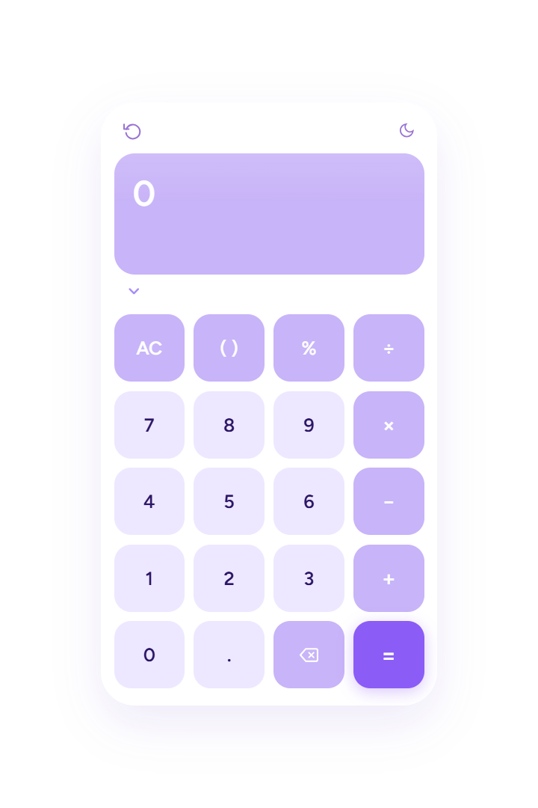
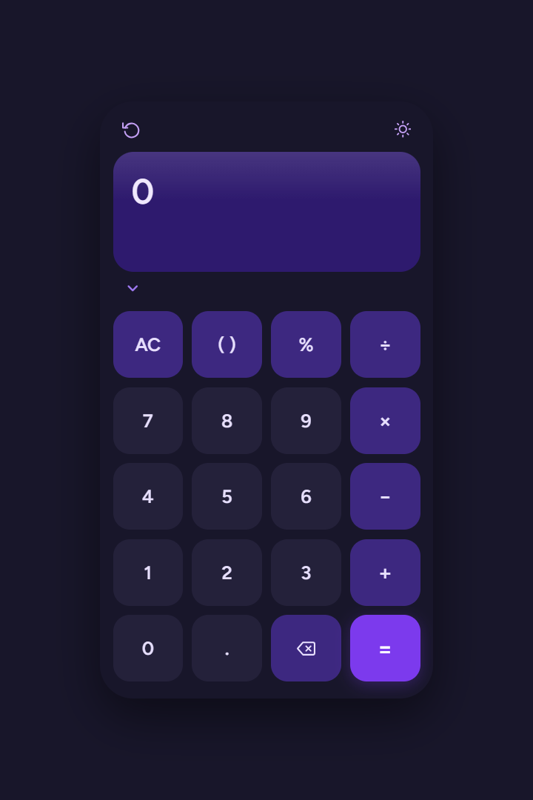
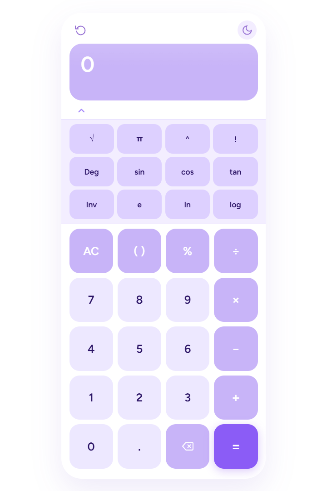
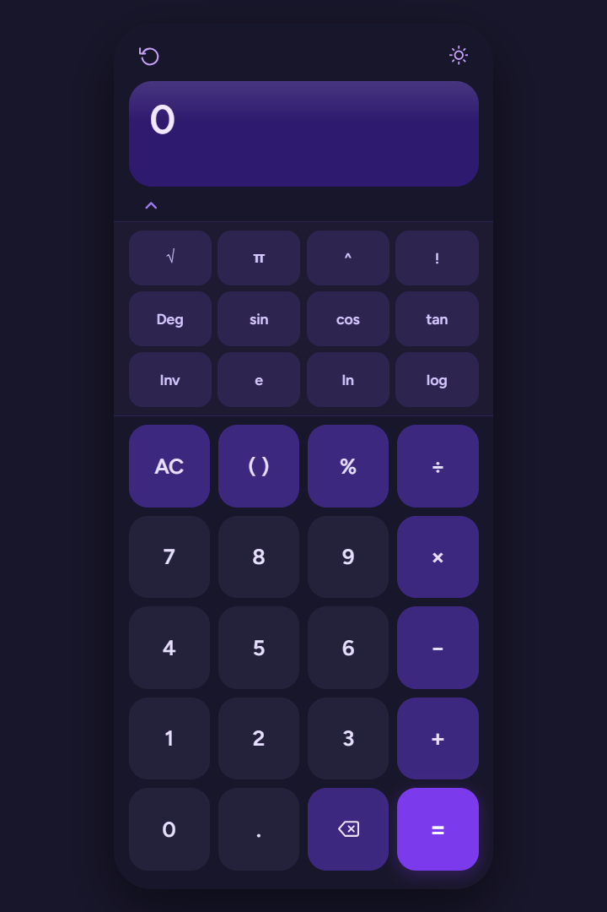

<div align="center">

# Modern Scientific Calculator

Aplicación web moderna, responsive y escalable con calculadora estándar y panel científico desplegable.

[]()
[]()
[]()
[]()
[]()
[]()

### Demo en línea

**https://modern-scientific-calculator-gamma.vercel.app/**

</div>

---

## Descripción

Modern Scientific Calculator es una aplicación desarrollada con HTML, CSS y JavaScript puro. Combina una calculadora tradicional con un panel científico desplegable mediante botón chevron, ofreciendo una experiencia intuitiva, moderna y adaptable a distintos dispositivos.

---

## Características principales

| Funcionalidad       | Descripción                                 |
| ------------------- | ------------------------------------------- |
| Operaciones básicas | Suma, resta, multiplicación y división      |
| Panel científico    | Funciones avanzadas ocultables/desplegables |
| Paréntesis          | Resolución de expresiones complejas         |
| Resultado en vivo   | Cálculo automático mientras se escribe      |
| Historial           | Registro de operaciones recientes           |
| Tema visual         | Modo claro y oscuro                         |
| Teclado físico      | Compatibilidad total                        |
| Responsive          | Adaptado a móvil, tablet y escritorio       |
| UI Moderna          | Interfaz limpia y profesional               |

---

## Funciones científicas

| Función                | Estado     |
| ---------------------- | ---------- |
| Potencias              | Disponible |
| Raíz cuadrada          | Disponible |
| Seno                   | Disponible |
| Coseno                 | Disponible |
| Tangente               | Disponible |
| Logaritmos             | Disponible |
| Constantes matemáticas | Disponible |
| Factorial              | Opcional   |

</div>

---

## Tecnologías utilizadas

<div align="center">

[]()
[]()
[]()
[]()

</div>

---

## Estructura del proyecto

```text id="e93m4k"
modern-scientific-calculator/
│── index.html
│── style.css
│── script.js
│── README.md
│── calculator-light.png
│── calculator-dark.png
│── scientific-light.png
│── scientific-dark.png
```

---

## Vista previa

## Calculadora estándar

| Modo claro                                    | Modo oscuro                                  |
| --------------------------------------------- | -------------------------------------------- |
|  |  |

---

## Calculadora científica

| Modo claro                                    | Modo oscuro                                  |
| --------------------------------------------- | -------------------------------------------- |
|  |  |

---

## Competencias demostradas

* Desarrollo frontend con JavaScript puro.
* Manipulación avanzada del DOM.
* Diseño de interfaces modernas.
* Componentes dinámicos e interactivos.
* Responsive Design.
* Gestión de eventos.
* Escalabilidad y mejora continua.
* Organización profesional del código.

---

## Enfoque profesional

Proyecto orientado a demostrar habilidades técnicas en desarrollo web mediante una solución funcional, visualmente cuidada y enfocada en experiencia de usuario, mantenibilidad y escalabilidad.

---

## Autor

**Yamilet Bustamante Cagal**
